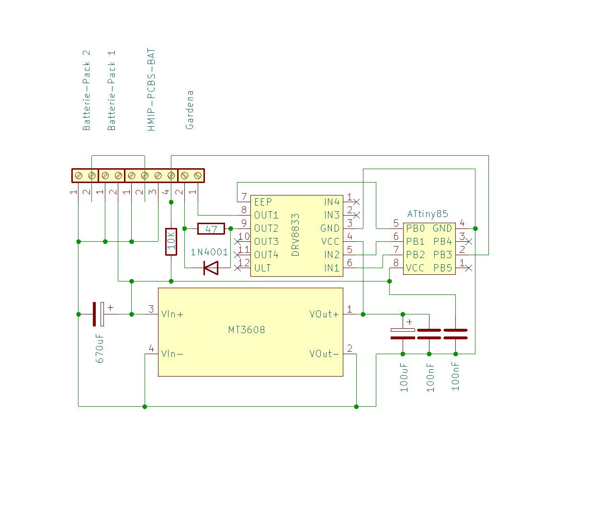
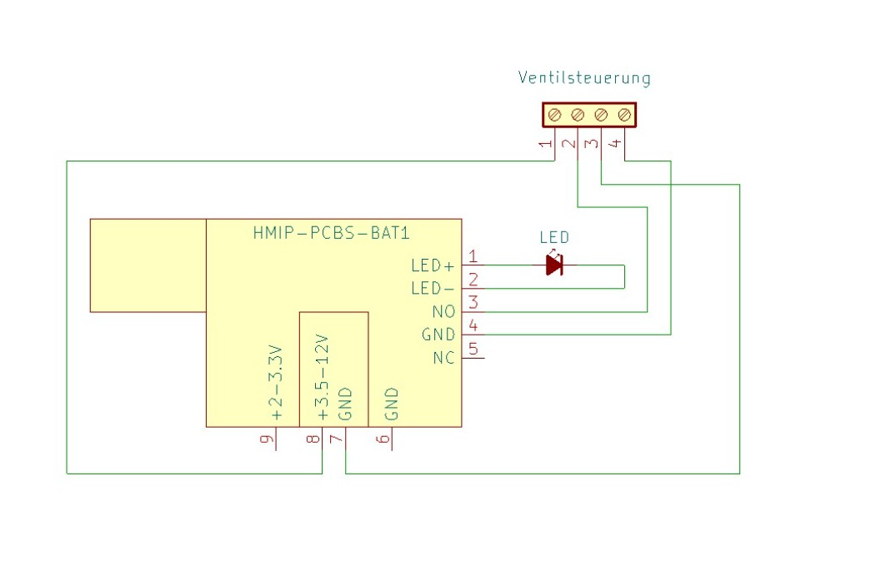

# Homematic IP Steuerung eines Gardena 9V Ventil

## Problem das gelöst werden soll

- Die Gardena Bewässerungscomputer mit Bluetooth lassen sich nicht zuverlässig mit dem Handy steuern.
- Die Bodenfeuchte-Sensoren die an den Ventilen angeschlossen sind funktionieren ebenfalls nicht zuverlässig. z.B. wird an Regentagen ein trockener Boden gemessen und dadurch noch zustzlich bewässert und auch in die andere Richtung wird an heissen Tagen nicht zuverlässig bewässert
- Unterschiedliche Systeme erhöhen die Komplexität und die Übersicht im SmartHome
- Gardena ist mit diesem System nicht offen und in kein anderes System integrierbar.

## High Level Requirements

- Ein Gardena 9V-Latchventil soll über das Homematic IP ansprechbar sein. 
- Die Automatisierung erfolgt (An/Ausschalten) erfolgt außerhalb dieser Schaltung über entsprechende HMiP Automatisierung
- Die Schaltung muss mit 4 AA-Zellen für 6 Monate lauffähig sein (Garten-Saison)
- Die Ganze Elektronik soll in einer relativ kleinen Abzweigdose (Spelsberg Abox 025) untergebracht werden
- Die Schaltung soll nur für ein einzelnes Ventil sein

## Hardware Komponenten

Die Steuerung basiert auf:

* [Homematic IP HMIP-PCBS-BAT als Funkmodul](hardware/hmippcbsbat/hmippcbsbat.md)
* [Gardena 9V Ventil](hardware/gardena/gardena.md)
* [ATtiny85 als Steuerlogik](hardware/ATtiny85/attiny85.md) 
* [DRV8833 als H-Brücke](hardware/drv8833/drv8833.md)
* [MT3608 als Step-up Wandler](hardware/mt3608/mt3608.md)
* [Spelsberg Abox 025 als Gehäuse](hardware/abox025/abox025.md)
* 4× AA Batterieversorgung (LifePo4)

## Materialliste

| Pos. | Bauteil            | Typ / Wert                         |       Menge | Bemerkung                           |
| ---: | ------------------ | ---------------------------------- | ----------: | ----------------------------------- |
|    1 | Funk-Schaltaktor   | HmIP-PCBS-BAT                      |           1 | Homematic IP Schaltplatine          |
|    2 | Mikrocontroller    | ATTiny85-20PU                      |           1 | DIP-8 Sockel                        |
|    3 | Motortreiber       | [DRV8833 Modul](https://www.amazon.de/DRV8833-2-Kanal-DC-Motorantriebsplatine-Motorantriebs-Eingangsspannung/dp/B0DHRFRG6X/ref=sr_1_3)                      |           1 | H-Brücke für Polaritätsumkehr       |
|    4 | Step-Up-Wandler    | [MT3608 Modul](https://www.amazon.de/Converter%EF%BC%8CEinstellbare-Spannungsreglerplatine-Power2V-24V-V%EF%BC%8CNetzteil-Kompatibel/dp/B0D9VJKD1L/)                       |           1 | Eingang 4–6 V, Ausgang 9 V          |
|    5 | Bewässerungsventil | Gardena 01815-00.707.00            |           1 | Hydraulikventil mit Cinch-Anschluss |
|    6 | Batteriehalter     | 2× AA                              |           2 | 1 x HMIP und 1 x Lastkreis (DRV8833,ATTiny,MT3608)              |
|    7 | Batterie           | [AA LiFePO4, 3.2V 600mAh](https://www.amazon.de/POWJIELI-Wiederaufladbarer-Selbstentladung-Solar-Gartenleuchten-Solarpfostenleuchten/dp/B0FLWY2FXT)            |           4 | Versorgung                          |
|    8 | Widerstand         | 10 kΩ                              |           1 | Pull-Up für HmIP-Ausgang            |
|    9 | Widerstand         | 47 Ω                               |           1 | Strombegrenzung Schließimpuls       |
|   10 | Diode              | 1N4001                             |           1 | Überbrückung des 47-Ω-Widerstands   |
|   11 | Kondensator        | 670 µF / ≥16 V                     |           1 | MT3608 Eingang                      |
|   12 | Kondensator        | 100 µF / ≥16 V                     |           1 | DRV8833 Versorgung                  |
|   13 | Kondensator        | 100 nF                             |           2 | DRV8833 und ATTiny85                |
|   14 | IC-Sockel          | DIP-8                              |           1 | Für ATTiny85                        |
|   15 | Terminal-Anschlussblock | [10 alt. 12 fach, 2.54](https://www.amazon.de/10Pcs-Terminal-Block-Steckverbinder-Schraubklemmenblock/dp/B07BVPJBK3)              |           1 | Gardena Ventil, Batterie, HMIP      |
|   17 | Gehäuse            | Spelsberg ABOX 025                 |           1 | Endmontage                          |
|   18 | Lochrasterplatine  | 24 Spalten (A–X),2.54              |           1 | Individuell zuschneiden             |
|   19 | Silberdraht        | 0,14–0,25 mm²                      | nach Bedarf | Verdrahtung                         |
|   20 | Schrumpfschlauch   | verschiedene Größen 1,5 / 3.5 /4.0 | nach Bedarf | Isolation                           |

## Schaltung - Komponentensicht

### Gardena Aktor

### Homematic IP

## Architektur
~~~
                    Gemeinsame Masse (GND)
                           │
        ┌──────────────────┴──────────────────┐
        │                                     │

   Batteriepack 1                       Batteriepack 2
      (Logik)                            (Leistung)
      2×AA / 6–7 V                       2×AA / 6–7 V
        │                                     │
        │                                     ├──────── ATTiny85
        │                                     ├──────── MT3608
        │                                     │
        │                                     └── MT3608 ── 9 V ── DRV8833 ── Gardena Ventil
        │
        └──────── HmIP-PCBS-BAT

HmIP Open-Drain Ausgang ───────────────► PB3 (ATTiny)
~~~

## Funktionsprinzip

Das Homematic-IP-Modul liefert ein digitales Open-Drain-Triggersignal an den ATTiny85.

Der ATTiny85 überwacht den Eingang kontinuierlich und erkennt jede Zustandsänderung (LOW→HIGH bzw. HIGH→LOW). Abhängig von der Richtung der Zustandsänderung erzeugt er einen kurzen Steuerimpuls:

Öffnen: 60 ms
Schließen: 250 ms

Der DRV8833 arbeitet als H-Brücke und kehrt für jeden Steuerimpuls die Polarität um. Dadurch kann das bistabile 9-V-Gardena-Magnetventil sowohl geöffnet als auch geschlossen werden.

## Stromversorgung

### Batterieversorgung

| Versorgung     | Spannung               | Versorgt                  |
| -------------- | ---------------------- | ------------------------- |
| Batteriepack 1 | 2× LiFePO₄ (6,0–7,2 V) | ATTiny85, MT3608, DRV8833 |
| Batteriepack 2 | 2× LiFePO₄ (6,0–7,2 V) | HmIP-PCBS-BAT             |

### Spannungsverteilung

| Komponente     | Versorgung          |
| -------------- | ------------------- |
| ATTiny85       | direkt aus Batterie |
| HmIP-PCBS-BAT  | direkt aus Batterie |
| MT3608 Eingang | direkt aus Batterie |
| DRV8833        | 9V vom MT3608       |
| Ventil         | 9V vom DRV8833      |

### Masseverteilung

Eine gemeinsame Masse - keine getrennten Massebereiche erforderlich.
~~~
Batteriepack 1 (+6 V)
    │
    ├── ATTiny85
    ├── MT3608
    └── DRV8833

Batteriepack 2 (+6 V)
    │
    └── HmIP-PCBS-BAT

Gemeinsame Masse (GND)
    ├── Batteriepack 1
    ├── ATTiny85
    ├── MT3608
    ├── DRV8833
    ├── HmIP-PCBS-BAT
    └── Batteriepack 2
~~~

## MT3608 Step Up Wandler

Der MT3608 erhöht die Batteriespannung auf 9V für:

- DRV8833
- Gardena-Ventil

| Parameter        | Wert |
| ---------------- | ---- |
| Ausgangsspannung | 9V   |

**WICHTIG*** 
Vor Inbetriebnahme die Ausgangsspannung mit Multimeter einstellen!

## HmIP-PCBS-BAT Homematic IP Funkmodul

Das Modul liefert ein Open-Drain-Schaltsignal an den ATTiny85.

| Zustand | Ausgang |
| ------- | ------- |
| aktiv   | LOW     |
| inaktiv | offen   |

### Pin Belegung

| Pin      | Funktion           | Verbindung       |
| -------- | ------------------ | ---------------- |
| NO       | Open-Drain-Ausgang | Normally Open, ATTiny85 PB3, 10 KOhm Pullup Widerstand gegen VCC     |
| NOC      | Open-Drain-Ausgang | -                |
| GND      | Masse              | gemeinsame Masse |
| +3.5-12V | Versorgung         | Batteriespannung |
| LED+     | LED                | LED +            |
| LED-     | LED                | LED -            |

### Schaltung
~~~
6.4V (VCC)
 │
 └── 10kΩ
       │
       ├──── ATTiny85 PB3
       │
HmIP-PCBS-BAT OUT
       │
      GND
~~~

## ATTiny85 Steuerlogik

Der ATTiny85 übernimmt:

- Flankenerkennung
- Impulssteuerung
- Polaritätssteuerung
- Sleep-Modus

### Pin Belegung

| ATTiny85 Pin | Port | Funktion        |
| ------------ | ---- | --------------- |
| 1            | PB5  | -               |
| 2            | PB3  | Trigger Eingang |
| 3            | PB4  | -               |
| 4            | GND  | Masse           |
| 5            | PB0  | DRV8833 SLP/EEP |
| 6            | PB1  | DRV8833 IN2     |
| 7            | PB2  | DRV8833 IN1     |
| 8            | VCC  | 6.4V            |

## DRV8833 H-Brücke

Der DRV8833 erzeugt:

- positive Polarität
- negative Polarität

für das bistabile Gardena-Ventil.

### Pin Belegung

| Pin   | Funktion          | Verbindung       |
| ----- | ----------------- | ---------------- |
| VCC   | Ventilversorgung  | 9V vom MT3608    |
| GND   | Masse             | gemeinsame Masse |
| IN1   | Richtung A        | ATTiny85 PB2     |
| IN2   | Richtung B        | ATTiny85 PB1     |
| IN3   | unbenutzt         | -                |
| IN4   | unbenutzt         | -                |
| OUT1  | Ventilanschluss A | Gardena 1        |   
| OUT2  | Ventilanschluss B | Gardena 2        |
| OUT3  | unbenutzt         | -                |
| OUT4  | unbenutzt         | -                |
| EEP   | Sleep-Eingang     | ATTiny85 PB0     |
| FAULT | Fehlerausgang     | -                |

### Schaltung

~~~
VCC ---- 100µF (Elko) ----- GND
  \
   \--- 100nF (Keramik) --- GND
~~~

- Elko zur Stabilisierung der 9V Versorgung
- Kermatik Kondesator kann sehr schnell reagieren zur Filterung von schnelle Spannungsspitzen, Schaltflanken, HF-Störungen

## Gardena 9V Ventil

## Ventil schließen

| Signal | Zustand |
| ------ | ------- |
| IN1    | LOW     |
| IN2    | HIGH    |
| Dauer  | 250 ms  |

## Ventil öffnen

| Signal | Zustand |
| ------ | ------- |
| IN1    | HIGH    |
| IN2    | LOW     |
| Dauer  | 60 ms   |

## Software / Steuerungslogic ATtiny85

* [Software Page](./Software/Sketch.md)

## Design-Werkzeuge

- KiCad 10.0, Schaltungs-Entwurf, https://www.kicad.org/
- Ardunino IDE 2.3.9, Sketch Entwicklung, https://docs.arduino.cc/software/ide/
- Trimble Sketchup for Web, 3D Modell Entwicklung, https://app.sketchup.com/app
- BambuLab 2.7.1.57, Slicer, https://bambulab.com/en/download/studio
- Fritzing 1.0.7, Lochraster Design, https://fritzing.org/download/

