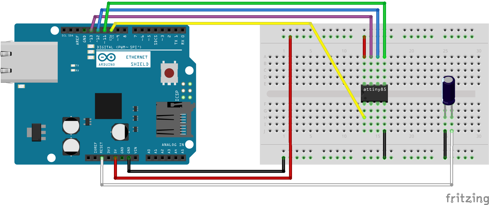

# Software für die Gardena Ventilschaltung (ATtiny85)

* [ArduninoISP.ino](./ArdunioISP.ino)
* [HomematicIPGardena.ino](./HomematicIPGardena.ino)

Zusätzliche Boardverwalter URL für Arduino IDE:
- https://raw.githubusercontent.com/damellis/attiny/ide-1.6.x-boards-manager/package_damellis_attiny_index.json
- https://github.com/damellis/attiny

# Software flashen

## Vorbereitung Arduino IDE
### ATtiny libs in Arduino IDE hinzufügen

1. Arduino IDE (hier 2.3.9) starten
2. Datei > Einstellungen > Zusätzliche Boardverwalter-URLs auswählen. Oben genannte URL einfügen. > OK
3. Öffnen des Boardverwalters unter Werkzeuge > Board > Boardverwalter.
4. attiny von David A. Mellis (hier 1.0.2) installieren

### Arduino UNO als Programmierer einrichten

1. Arduino UNO mit USB an Rechner anschließen
2. Arduino IDE starten
3. Datei > Beispiele > ArduinoISP > ArduinoISP
4. Im Pulldown Menü Arduino UNO am entsprechenden COM Port auswählen
5. Sketch auf Arduino UNO hochladen

## Hardware vorbereiten
### Attiny für Flashvorgang verkabeln

Den ATtiny85 wird mit einem Arduino UNO als Programmierer (ISP) geflasht.
Dazu wird der ATtiny85 auf ein Breadboard gesteckt und folgende Pins mit dem Arduino UNO verbunden.

| Arduino Uno | ATTiny85 Pin     |
| ----------- | ---------------- |
| D10         | Pin 1 (RESET)    |
| D11         | Pin 5 (PB0/MOSI) |
| D12         | Pin 6 (PB1/MISO) |
| D13         | Pin 7 (PB2/SCK)  |
| 5V          | Pin 8 (VCC)      |
| GND         | Pin 4 (GND)      |

Ein 10yF Elko muss zwischen Pin 1 und GND eingebaut werden.

## Software hochladen
### Program auf ATtiny85 schreiben

1. Arduino IDE öffnen und Gardena Sketch laden
2. Attiny25/45/85 Board am entsprechenden COM port auswählen
3. Taktfrequenz einstellen: Werkzeuge > Clock: Internal 1 MHz ausählen
4. Prozessor einstellen: Werkzeuge > Prozessor > ATtin85 auswählen
5. Programmier Methode einstellen: Werkzeuge > Programmer > ArduinoISP als Programmer auswählen
6. Upload durchführen: **Wichtig** Sketch > Mit Programmer hochladen
