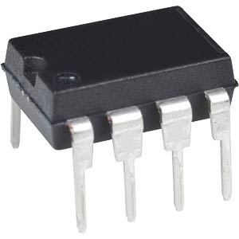
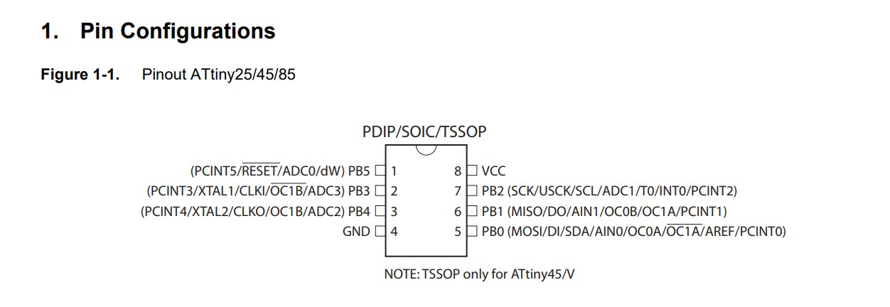

# Atmel 8-Bit-AVR-Mikrocontroller mit 8K Byte In-System programmierbarem Flash

## Merkmale:
- Hochleistungs-, stromsparender AVR® 8-Bit-Mikrocontroller
- Fortgeschrittene RISC-Architektur
- 120 leistungsstarke Anweisungen - die meisten Ein-Takt-Zyklus-Ausführungen
- 32 x 8 Arbeitsregister für allgemeine Zwecke
- Vollständig statischer Betrieb
- Nichtflüchtige Programm- und Datenspeicher
- 8K Byte systeminterner programmierbarer Programmspeicher Flash, 10.000 Schreib-/Löschzyklen
- 512 Bytes In-System programmierbares EEPROM, 100.000 Schreib-/Löschzyklen
- 512 Bytes interner SRAM
- Programmiersperre für selbstprogrammierendes Flash-Programm und EEPROM-Datensicherheit

### Periphere Merkmale
- 8-Bit-Timer/-Zähler mit Vorteiler und zwei PWM-Kanälen
- 8-Bit-Hochgeschwindigkeits-Zeitgeber/-Zähler mit separatem Vorteiler
- 2 Hochfrequenz-PWM-Ausgänge mit getrennten Ausgangs-Vergleichsregistern
- Programmierbarer Totzeit-Generator
- USI - Universelle serielle Schnittstelle mit Startbedingungsdetektor
- 10-Bit-ADC
- 4 Kanäle mit einem Ende
- Differentielle ADC-Kanalpaare mit programmierbarer Verstärkung (1x, 20x)
- Temperaturmessung
- Programmierbarer Watchdog-Timer mit separatem On-Chip-Oszillator
- On-Chip-Analogkomparator
- Industrieller Temperaturbereich

### Besondere Mikrocontroller-Merkmale
- debugWIRE On-chip-Debug-System
- Im System über SPI-Port programmierbar
- Externe und interne Interrupt-Quellen
- Niedrigleistungs-Leerlauf, ADC-Rauschunterdrückung und Abschaltmodi
- Erweiterte Power-on-Reset-Schaltung
- Programmierbare Brown-out-Erkennungsschaltung
- Intern kalibrierter Oszillator

### E/A und Bauformen
- Sechs programmierbare E/A-Leitungen
- 8-polige PDIP, 8-poliger SOIC, 20-poliges QFN/MLF

### Betriebsspannung
- 1,8 - 5,5V für ATtiny85V
- 2,7 - 5,5V für ATtiny85

### Geschwindigkeits-Grad
- ATtiny85V: 0 - 4 MHz bei 1,8 - 5,5V, 0 - 10 MHz bei 2,7 - 5,5V
- ATtiny85: 0 - 10 MHz bei 2,7 - 5,5V, 0 - 20 MHz bei 4,5 - 5,5V, 0 - 20 MHz bei 4,5 - 5,5V

### Leistungsaufnahme
- Aktiver Modus: 1 MHz, 1,8V: 300 µA
- Abschaltmodus: 0,1 µA bei 1,8V

## Pin Belegung

## Datenblatt
[Datenblatt](./attiny85.pdf)