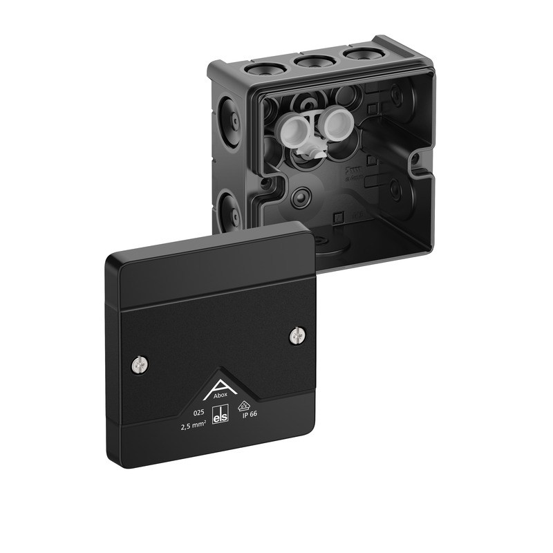

# Spelsberg Abox 025

Abzweigkasten, mit Schutzart IP66, Nennquerschnitt 2,5 mm², zertifiziert durch VDE (DIN EN 60670-1/-22 (VDE 0606-1/-22)), DLG (Ammoniakbeständigkeit), selbstdichtende, weiche Einführungsmembranen, M16/M20, Dichtbereich 4 - 16 mm, (1 rückseitig, 8 seitlich), innenliegende Befestigungsstellen, für Standardinstallationen im Innenbereich und geschütztem Außenbereich

