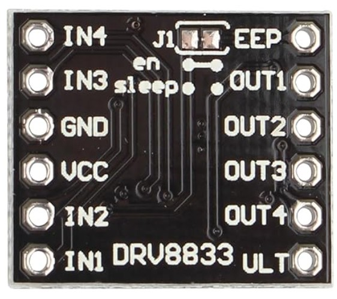
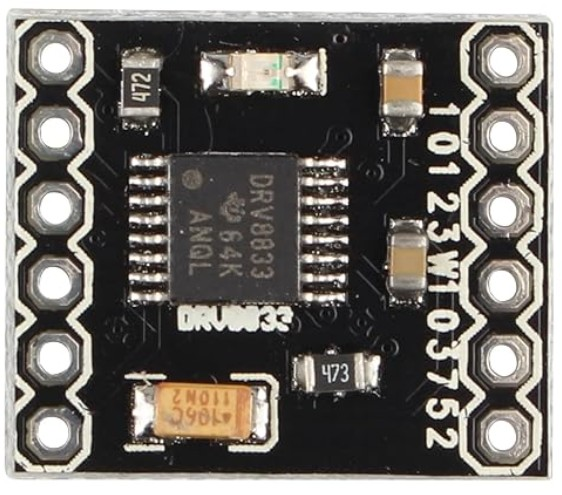
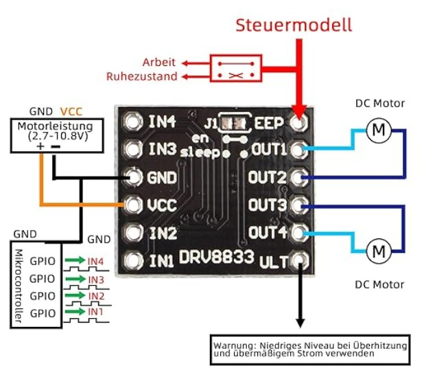

# DRV8833 1.5A 2-Kanal H Brücke DC-Motorantriebsplatine Ultra Small Volume Motorantriebs modul

- Der Motortreiber kann bei einem Konstantstrom von 1,0 A (4 A Spitze) bis zu zwei DC-Motoren steuern.
- Zwei Eingangssignale (IN1 und IN2) können verwendet werden, um den Motor in einem von vier Funktionsmodi zu steuern – Uhrzeigersinn (CW), gegen den Uhrzeigersinn (CCW), kurze Pause und Stopp.
- Eingebauter Überstromschutz, Kurzschlussschutz, Unterspannungsabschaltung und Übertemperaturschutz. Im Energiesparmodus.
- Die zwei Motorenausgänge (A und B) können separat gesteuert werden, die Geschwindigkeit jedes Motors wird über ein PWM-Eingangssignal mit einer Frequenz bis zu 100 kHz gesteuert.

## Netzstrom 
- VM = 2,7–10,8 V.
- Ausgangsstrom: Iout = 1,0 A (Durchschnitt) / 4 A (Spitze).

## DRV8833 Merkmale

| Eigenschaft            | Wert                        |
| ---------------------- | --------------------------- |
| Versorgung VM          | 2.7V – 10.8V                |
| Sleep-Strom            | typ. 1.6 µA                 |
| H-Brücken              | 2                           |
| Ausgangsstrom          | 1.5A RMS / 2A Peak          |
| Technologie            | MOSFET                      |
| Polaritätsumkehr       | ja                          |
| Schutzfunktionen       | Überstrom, Temperatur, UVLO |
| Eingangskompatibilität | 3.3V / 5V GPIO              |

## Datenblatt
[Datenblatt](./drv8833.pdf)

## Bilder

## Pin Belegung

| Pin   | Richtung | Funktion                       | Anschluss                   |
| ----- | -------- | ------------------------------ | --------------------------- |
| VCC   | Eingang  | Versorgung DRV8833 (2.7–10.8V) | 9V vom MT3608               |
| GND   | Eingang  | Masse                          | Gemeinsame GND              |
| IN1   | Eingang  | Steuerung Kanal A Richtung 1   | ATTiny85 PB2                |
| IN2   | Eingang  | Steuerung Kanal A Richtung 2   | ATTiny85 PB1                |
| IN3   | Eingang  | Steuerung Kanal B Richtung 1   | -                           |
| IN4   | Eingang  | Steuerung Kanal B Richtung 2   | -                           |
| OUT1  | Ausgang  | Kanal A Ausgang 1              | Ventil 1 Leitung A          |
| OUT2  | Ausgang  | Kanal A Ausgang 2              | Ventil 1 Leitung B          |
| OUT3  | Ausgang  | Kanal B Ausgang 1              | -                           |
| OUT4  | Ausgang  | Kanal B Ausgang 2              | -                           |
| SLP   | Eingang  | Sleep-Steuerung                | ATTiny85 PB0.               |
| FAULT | Ausgang  | Fehlerausgang                  | Optional / offen            |

## Truth Table

(OUT1 und OUT2) sowie (OUT3 und OUT4) gehören fest zu einer H-Brücke und können nicht unabhängig voneinander verwendet werden.

| IN1 | IN2 | Ausgang         |
| --- | --- | --------------- |
| 1   | 0   | OUT1=H / OUT2=L |
| 0   | 1   | OUT1=L / OUT2=H |
| 0   | 0   | Hi-Z / Coast    |
| 1   | 1   | Brake           |

| IN1  | IN2  | OUT1 | OUT2 |
| ---- | ---- | ---- | ---- |
| HIGH | LOW  | +9V  | GND  |
| LOW  | HIGH | GND  | +9V  |

