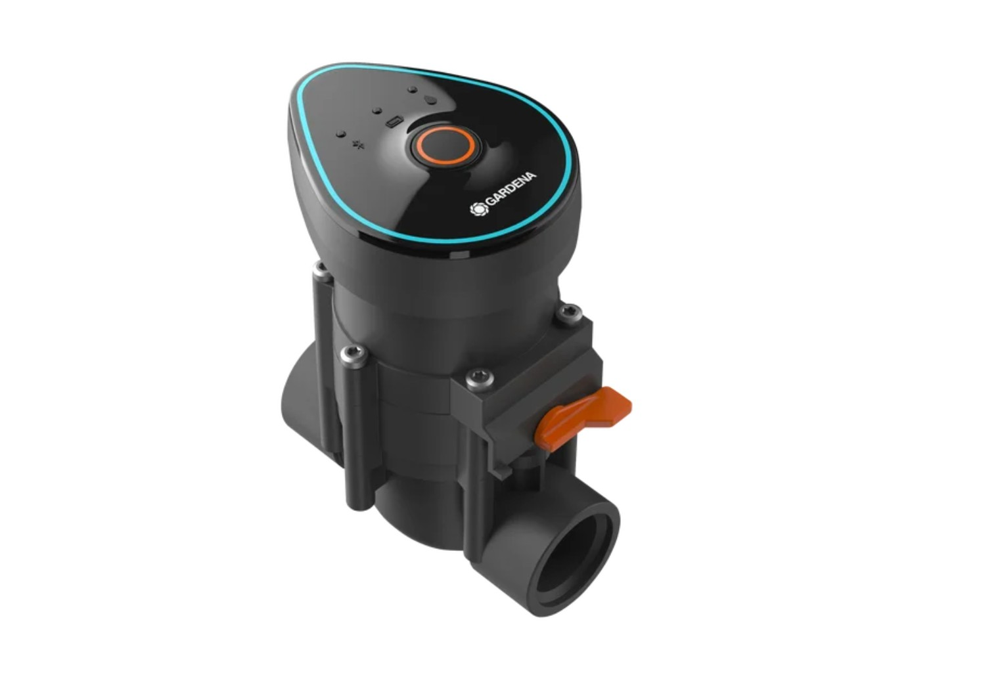

# Gardena 1251-20 9V Ventil

# Beschreibung

Das Bewässerungsventil ist bistabil, d.h. es benötigt einen Stromimpuls zum Öffnen und einen weiteren um wieder zu schließen.

# Ansteuerung

Für Gardena 9 V bistabile Ventile gilt:

|Funktion        |Spannung     |Strom          |Zeit         |
|----------------|-------------|---------------|-------------|
|Öffnen	         |+9 V	       |~250–350 mA	   |~250 ms      |
|Schließen       |-9 V	       |~20–80 mA	   |~62,5 ms     |

**Wichtig: Der Strom muss beim Schließen auf 80mA begrenzt werden sonst schließt das Ventil nicht!**

* [Gardena Technische Information](https://help.gardena.com/hc/de/articles/4450459219100-Welche-technischen-Daten-hat-das-9-V-Bew%C3%A4sserungsventil)

Die technischen Daten passen auch für die Bewässerungscomputer (Gardena Bluetooth) Artikel-Nr. 1889-20
- https://www.gardena.com/de/produkte/bewaesserung/bewaesserungssteuerung/bewaesserungssteuerung-bluetooth/970481101.html

# Dokumente

* [Ersatzteile](./gardena-ersatzteile.pdf)
* [Handbuch](./gardena-handbuch.pdf)
* [Ventil-Handbuch](./gardena-ventil.pdf)
* [Forum](https://homematic-forum.de/forum/viewtopic.php?f=19&t=2971#p15995)
* [Raspberry Forum](https://forum-raspberrypi.de/forum/thread/42577-umbau-gardena-bewaesserungsventil-1251-20-9v-auf-homematic/?postID=373335#post373335)
 