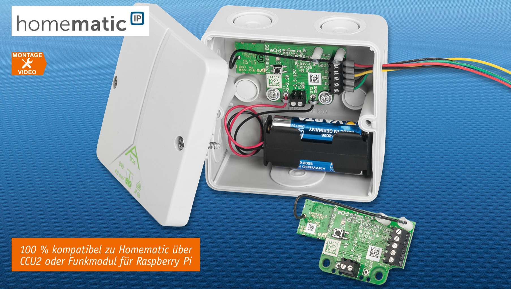
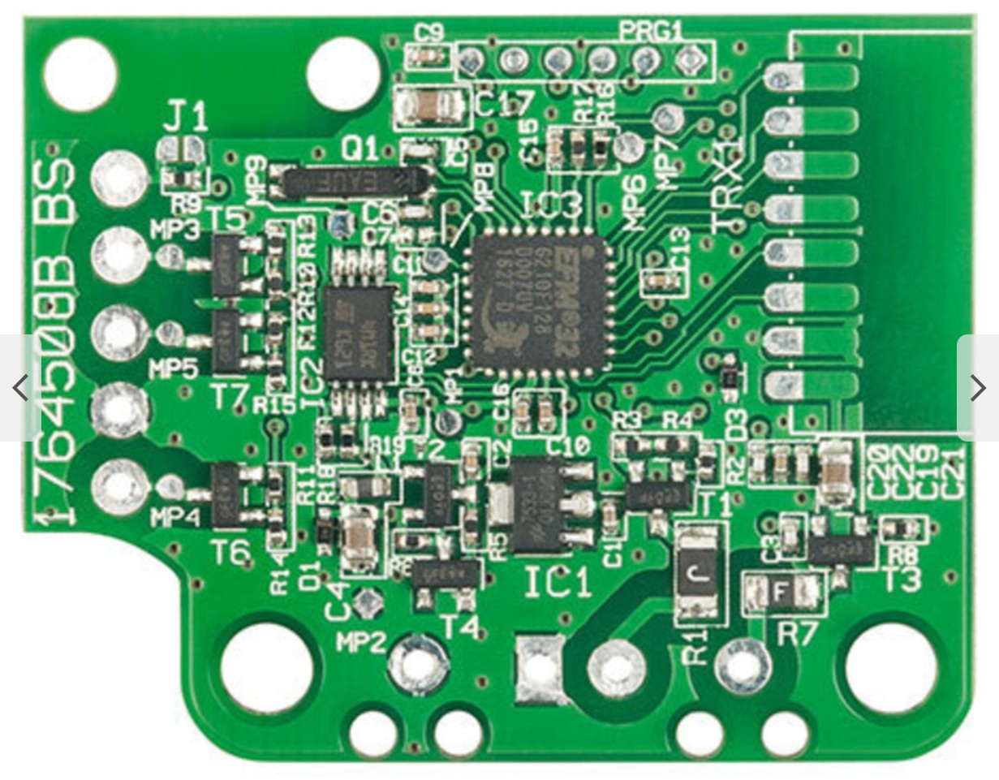
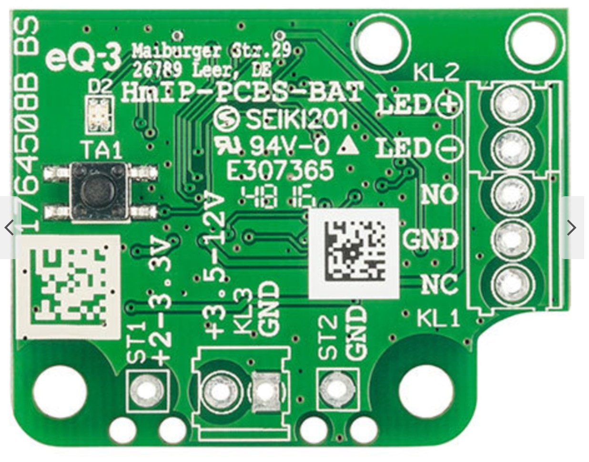
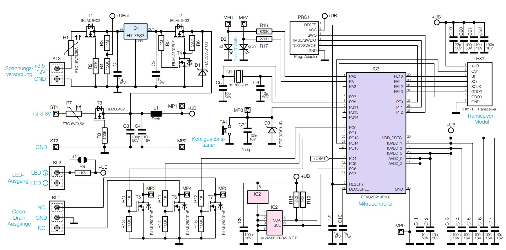

# Homematic IP Schaltaktor HMIP-PCBS-BAT für Batteriebetrieb

Baut man ein Smart Home Systems auf, steht man früher oder später unweigerlich vor der Aufgabe, eine Fernsteuerung weit ab von einer Netzstromversorgung ausführen zu wollen. Dann muss man auf Batterien, Akkus oder Solarzellen als Stromversorgung setzen. Genau dies ist der Einsatzort der neuen Schaltplatine für Batteriebetrieb. Aufgrund ihrer geringen Größe und ihres geringen Stromverbrauchs ist sie einfach in eigene Applikationen integrierbar.

## Merkmale

| Eigenschaft                      | Wert                                               |
| -------------------------------- | -------------------------------------------------- |
| Geräte-Kurzbezeichnung           | HmIP-PCBS-BAT                                      |
| Versorgungsspannung              | 2–3,3 VDC / 3,5–12 VDC                             |
| Stromaufnahme                    | max. 40 mA                                         |
| Ausgänge                         | 2× Open-Drain 20 V / 3 A                           |
| Ausgangszustände                 | 1× in Ruhe offen / 1× in Ruhe geschlossen          |
| Zusätzlicher Ausgang             | 1× LED-Ausgang                                     |
| LED-Betrieb                      | mit integriertem oder externem Vorwiderstand       |
| Besonderheit                     | für stromsparenden Batterie-/Akkubetrieb optimiert |
| Leitungsart                      | starre oder flexible Leitung                       |
| Leitungsquerschnitt              | 0,75–1,0 mm²                                       |
| Maximale Leitungslänge           | 3 m                                                |
| Umgebungstemperatur              | -10 bis +55 °C                                     |
| Schutzklasse                     | III                                                |
| Verschmutzungsgrad               | 2                                                  |
| Abmessungen (B × H × T)          | 60 × 34 × 17 mm                                    |
| Gewicht                          | 11 g                                               |
| Funkmodul                        | TRX1-TIF                                           |
| Funkfrequenzband                 | 868,0–868,6 MHz / 869,4–869,65 MHz                 |
| Funksendeleistung                | max. 10 dBm                                        |
| Empfängerkategorie               | SRD category 2                                     |
| Typische Funkreichweite Freifeld | 250 m                                              |
| Duty Cycle                       | < 1 % pro h / < 10 % pro h                         |

## Bilder

## Schaltung

## Referenzen

- [ELV Produktseite](https://de.elv.com/p/homematic-ip-ganz-flexibel-schaltplatine-hmip-pcbs-bat-fuer-batteriebetrieb-P207141/?itemId=207141)
- [Schaltplan](./hmippcbsbat-schaltung.pdf)
- [ELV Artikel](./hmippcbsbat-journal.pdf)