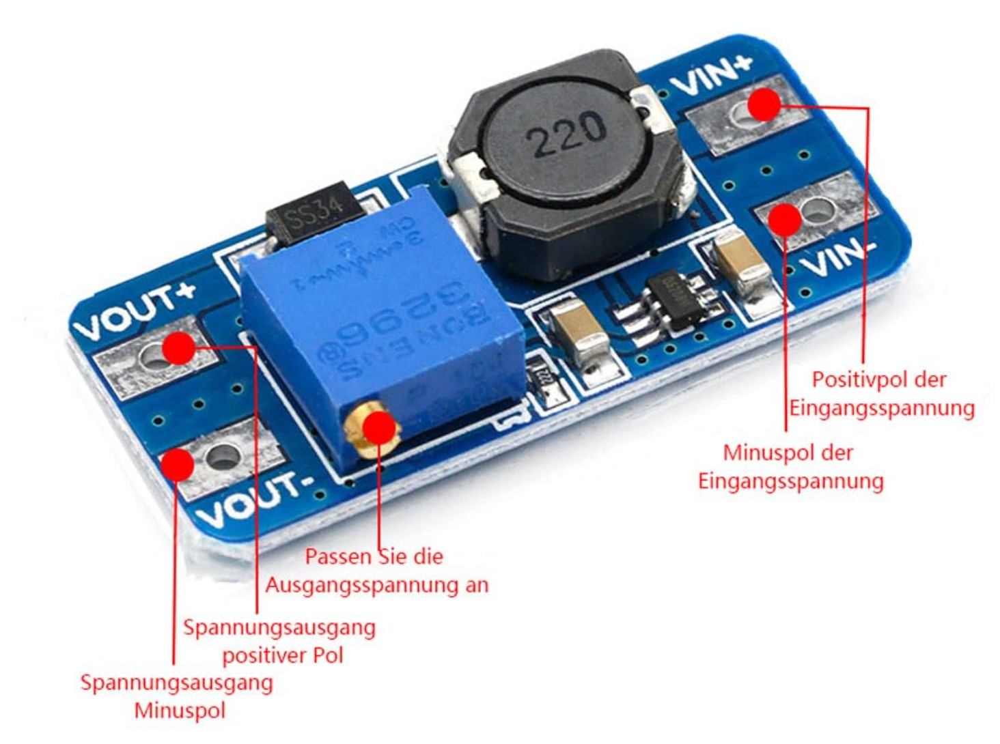

# MT3608 Mini DC-DC-Step up Wandler

Der MT3608 ist ein 2-A-DC/DC-Aufwärtswandlermodul (Boost-Wandler), das Eingangsspannungen von nur 2 V auf eine einstellbare Ausgangsspannung von bis zu 28 V hochwandeln kann. Es zeichnet sich durch einen Wirkungsgrad von 97 %, eine Schaltfrequenz von 1,2 MHz und eine integrierte Soft-Start-Technologie aus. Auch im Jahr 2026 gilt es aufgrund seiner geringen Kosten und des SOT-23-Formfaktors weiterhin als Goldstandard für die Stromversorgung von Arduino-, ESP32- und IoT-Projekten über Li-Ionen-Akkus.

## Technische Eigenschaften

| Eigenschaft      | Wert                            |
| ---------------- | ------------------------------- |
| Typ              | DC/DC Step-Up Converter         |
| Funktion         | Spannungsaufwärtswandler        |
| Eingangsspannung | 2V – 24V                        |
| Ausgangsspannung | bis 28V                         |
| Ausgangsstrom    | typ. bis 2A                     |
| Wirkungsgrad     | bis ca. 93–97 %                 |
| Schaltfrequenz   | 1.2 MHz                         |
| Ruhestrom        | typ. 100–200 µA                 |
| Shutdown-Strom   | typ. 0.1 µA                     |
| Schutzfunktionen | Überstrom, Übertemperatur, UVLO |
| Gehäuse IC       | SOT23-6                         |
| Regelung         | PWM/PFM                         |

## Pinbelegung

| Modulanschluss | Funktion    |
| -------------- | ----------- |
| VIN+           | Eingang +   |
| VIN-           | Eingang GND |
| VOUT+          | Ausgang +   |
| VOUT-          | Ausgang GND |

## Referenzen
- [mt3608 Datenblatt](./mt3608.pdf)
